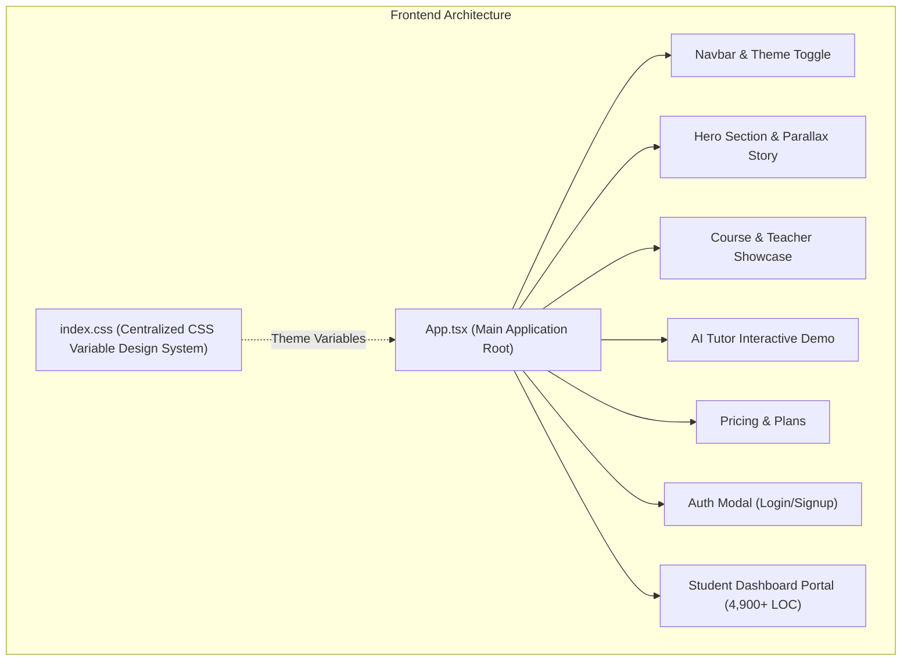

# 🚀 Complete Platform Overview — EdTech SaaS Platform

> [!NOTE]
> **EdTech SaaS Platform** is a state-of-the-art, high-converting learning management & student dashboard application built with **React**, **TypeScript**, **Tailwind CSS**, and modern **CSS Custom Variable Theme Architecture**.

---

## 📐 Architecture & Technology Stack

---

## 🎨 Global Design & Theme System (`src/index.css`)

The application uses a **fully centralized CSS Custom Variable system** supporting seamless **Light Mode** and **Dark Mode** theme switching without hardcoded values.

### Current Theme Palette (Apple + Linear + Stripe Precision Style)
- **Base Background**: Light `#FAFAFA` | Dark `#09090B`
- **Surface / Cards**: Light `#FFFFFF` / `#F4F4F5` | Dark `#18181B` / `#27272A`
- **Primary Brand / Action**: Light `#2563EB` (Blue 600) | Dark `#3B82F6` (Blue 500)
- **Primary Text**: Light `#18181B` (Zinc 900) | Dark `#FAFAFA` (Zinc 50)
- **Secondary Text**: Light `#71717A` (Zinc 500) | Dark `#A1A1AA` (Zinc 400)
- **Border**: Light `#E4E4E7` (Zinc 200) | Dark `#3F3F46` (Zinc 700)

---

## 🧩 Public Landing Page Components

| Component | File Path | Key Features & Responsibilities |
| :--- | :--- | :--- |
| **Navbar** | [Navbar.tsx](file:///d:/Wep%20Application/Personal%20Projects/EdTech-SaaS-Platform-/Fontend/src/components/Navbar.tsx) | Sticky Glassmorphism Header, Light/Dark Theme Switcher, Quick Navigation links, Portal Login Button. |
| **Hero Section** | [Hero.tsx](file:///d:/Wep%20Application/Personal%20Projects/EdTech-SaaS-Platform-/Fontend/src/components/Hero.tsx) | High-impact headlines, interactive CTA buttons, animated statistics counters (Active Students, Qualified Teachers, Success Rate). |
| **Scroll Story** | [CinematicScrollStory.tsx](file:///d:/Wep%20Application/Personal%20Projects/EdTech-SaaS-Platform-/Fontend/src/components/CinematicScrollStory.tsx) | Parallax scroll-triggered story demonstrating platform benefits and learning workflows. |
| **Feature Cards** | [FeatureCards.tsx](file:///d:/Wep%20Application/Personal%20Projects/EdTech-SaaS-Platform-/Fontend/src/components/FeatureCards.tsx) | Highlights Live HD Streaming, AI Tutor Assistance, Homework Grading, and Parent Reports. |
| **Course Showcase** | [CourseShowcase.tsx](file:///d:/Wep%20Application/Personal%20Projects/EdTech-SaaS-Platform-/Fontend/src/components/CourseShowcase.tsx) | Course grid with filters (A/L Physical Science, Bio Science, Commerce, Technology), teacher badges, and syllabus previews. |
| **Syllabus Panel** | [SubjectSyllabusPanel.tsx](file:///d:/Wep%20Application/Personal%20Projects/EdTech-SaaS-Platform-/Fontend/src/components/SubjectSyllabusPanel.tsx) | Detailed topic-by-topic curriculum breakdowns with downloadable module previews. |
| **Teacher Section** | [TeacherSection.tsx](file:///d:/Wep%20Application/Personal%20Projects/EdTech-SaaS-Platform-/Fontend/src/components/TeacherSection.tsx) & [TeacherProfileContainer.tsx](file:///d:/Wep%20Application/Personal%20Projects/EdTech-SaaS-Platform-/Fontend/src/components/TeacherProfileContainer.tsx) | Experienced faculty bios, academic qualifications, student ratings, and intro videos. |
| **AI Assistant Demo** | [AiDashboardShowcase.tsx](file:///d:/Wep%20Application/Personal%20Projects/EdTech-SaaS-Platform-/Fontend/src/components/AiDashboardShowcase.tsx) & [AiTutorDemo.tsx](file:///d:/Wep%20Application/Personal%20Projects/EdTech-SaaS-Platform-/Fontend/src/components/AiTutorDemo.tsx) | Live interactive AI study companion widget demonstrating automatic problem solving and instant answers. |
| **Pricing** | [Pricing.tsx](file:///d:/Wep%20Application/Personal%20Projects/EdTech-SaaS-Platform-/Fontend/src/components/Pricing.tsx) | Tiered pricing plans (Single Subject, Full Stream Pass, Premium All-Access) with monthly/annual toggle. |
| **Testimonials** | [Testimonials.tsx](file:///d:/Wep%20Application/Personal%20Projects/EdTech-SaaS-Platform-/Fontend/src/components/Testimonials.tsx) | Student and parent success reviews with island-wide island rank achievements. |
| **Auth Modal** | [AuthModal.tsx](file:///d:/Wep%20Application/Personal%20Projects/EdTech-SaaS-Platform-/Fontend/src/components/AuthModal.tsx) | Modal supporting Student/Teacher authentication, tab switching, and password reset flows. |
| **Footer** | [Footer.tsx](file:///d:/Wep%20Application/Personal%20Projects/EdTech-SaaS-Platform-/Fontend/src/components/Footer.tsx) | Comprehensive site directory, social links, newsletter signup, and copyright branding. |

---

## 🎓 Student Dashboard Portal (`src/components/StudentDashboard.tsx`)

The **Student Dashboard** is an expansive, production-ready portal (4,900+ lines of code) providing a complete digital campus experience:

### 1. Subject Management & Learning Tabs
- **Enrolled Classes Hub**: Overview of active subjects (Combined Maths, Advanced Physics, Advanced Chemistry, Biology).
- **HD Video Class Player**: Live and recorded lecture streaming with speed controls, chapter markers, and lesson attachments.
- **Subject Notes & Materials**: Categorized PDF lecture notes, past papers, and revision packages.
- **Interactive Whiteboard & Notes**: Built-in notepad and sketch area for taking live class notes.
- **Direct Teacher Messaging**: In-app chat interface to message subject teachers directly.
- **Academy AI Study Companion**: Embedded AI tutor tuned for island-wide A/L syllabi Q&A.

### 2. Finance, Payments & Invoices
- **Monthly Class Fee Status**: Real-time tracking of paid vs. pending monthly subject fees.
- **Multi-Method Payment Gateways**: Supports **Online Card Payment Gateway** and **Bank Slip Upload Verification**.
- **Payment History & Transaction Log**: Organized monthly audit trail with dates, reference IDs, and payment methods.
- **Downloadable PDF Receipts**: Instant receipt modal generator for past transactions.

### 3. Bookstore & Special Materials Order
- **Special Book Marketplace**: Purchase official institute theory books, revision guides, and model paper bundles.
- **Filter by Subject**: Quick filter books by Combined Maths, Physics, Chemistry, or Biology.

### 4. Progress, Exams & Attendance
- **Exam Results & Performance Analytics**: Detailed mark sheets and grade distribution graphs.
- **Attendance Tracker**: Class-by-class attendance logs showing physical hall and online attendance status.

---

## 💡 Key Highlights & Production Standards

1. **Zero Hardcoded Colors**: All colors use semantic CSS variables (`var(--bg-main)`, `var(--brand-primary)`, `var(--text-primary)`), making theme customizations instant.
2. **Enhanced Typography & Readability**: Enlarged transaction text, invoice headers, and card labels for effortless scanning.
3. **Fully Responsive**: Mobile-first responsive layouts with smooth drawer menus and dynamic grid layouts.
